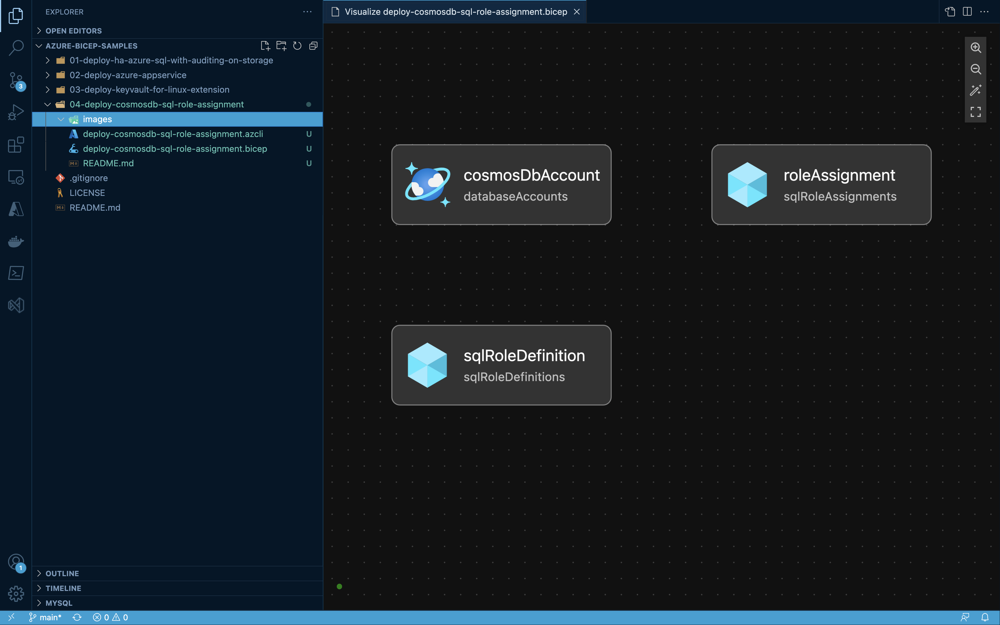
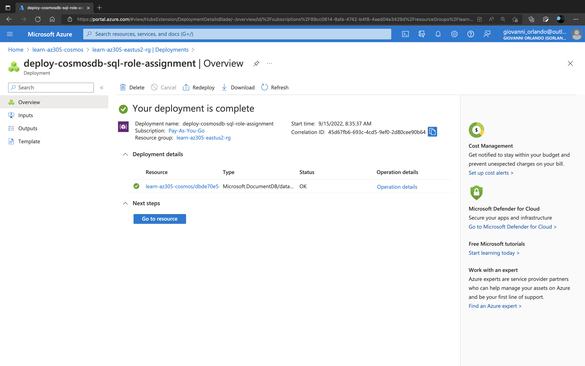

# 04 - Deploy Cosmos DB SQL Role Assignment

## Azure Resources - Visualizer



## Cosmos DB SQL Roles Supported

|ID|Name|
|-|-|
|00000000-0000-0000-0000-000000000001|Cosmos DB Built-in Data Reader|
|00000000-0000-0000-0000-000000000002|Cosmos DB Built-in Data Contributor|

## Usage 
1. Navigate to directory
```bash
cd ~/Downloads/azure-bicep-samples/04-deploy-cosmosdb-sql-role-assignment
```
2. Make AZ CLI script executable
```bash
chmod +x ./deploy-cosmosdb-sql-role-assignment
```
3. Run AZ CLI script to run the bicep deployment
```bash
./deploy-cosmosdb-sql-role-assignment
```



## References

[Configure role-based access control with Azure Active Directory for your Azure Cosmos DB account](https://docs.microsoft.com/en-us/azure/cosmos-db/how-to-setup-rbac)

[Azure CLI Cosmos DB Role Assignment](https://docs.microsoft.com/en-us/cli/azure/cosmosdb/sql/role/assignment?view=azure-cli-latest)