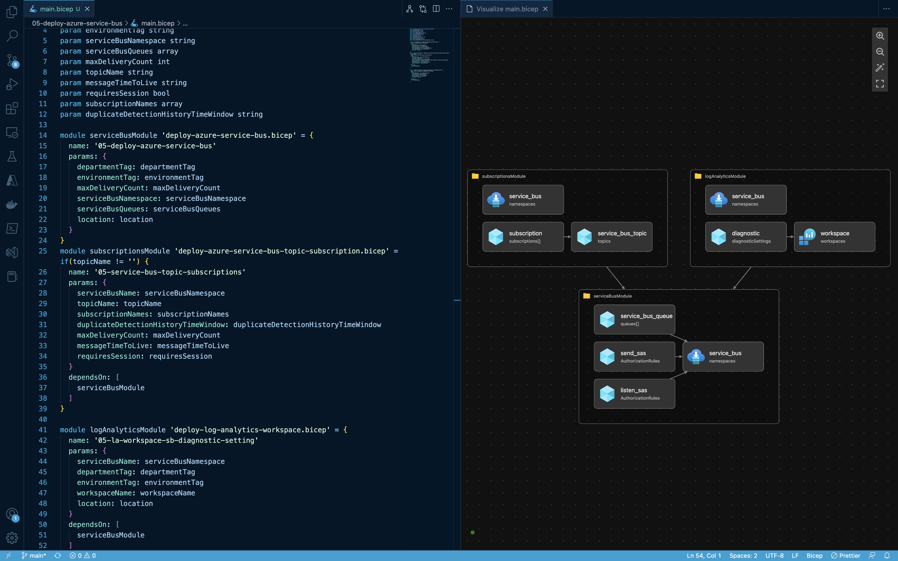
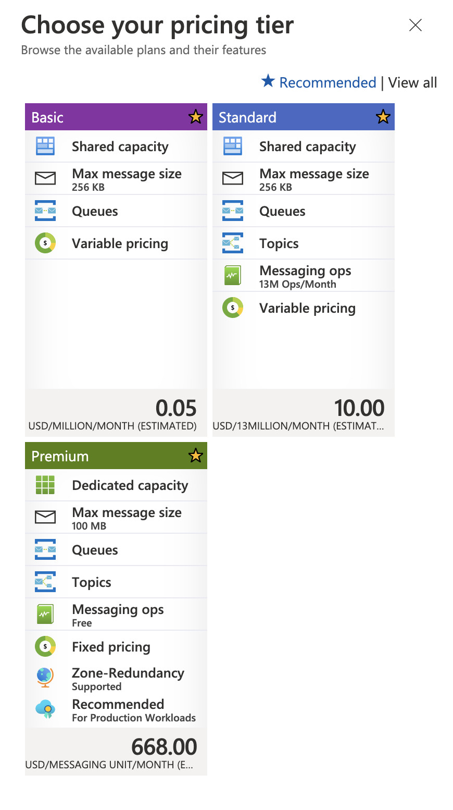
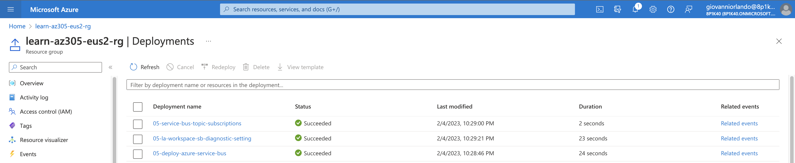
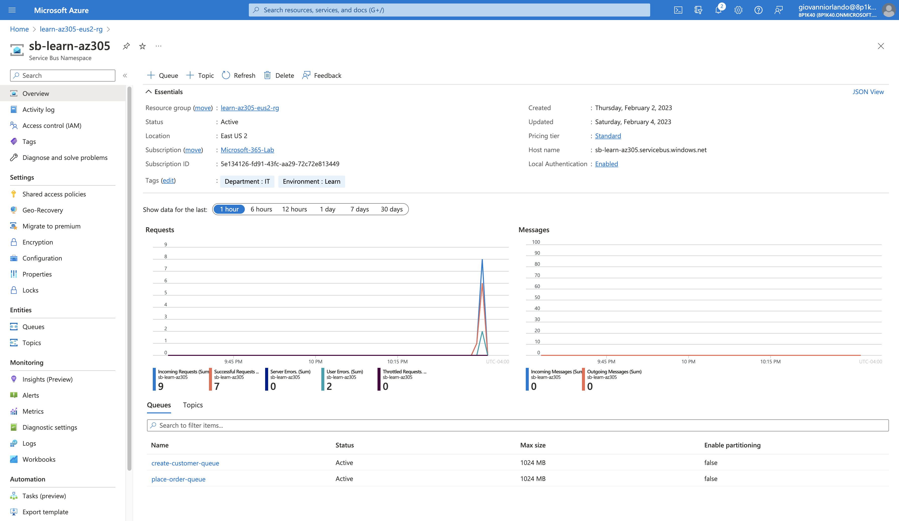
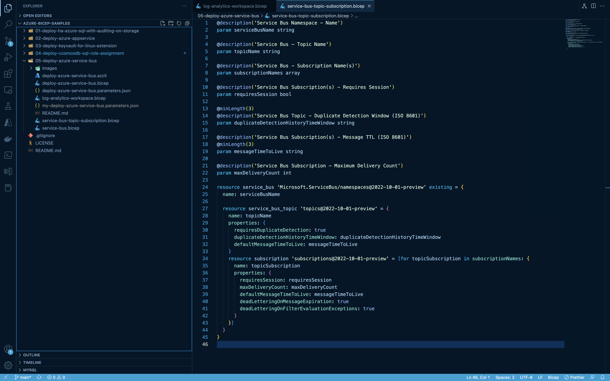
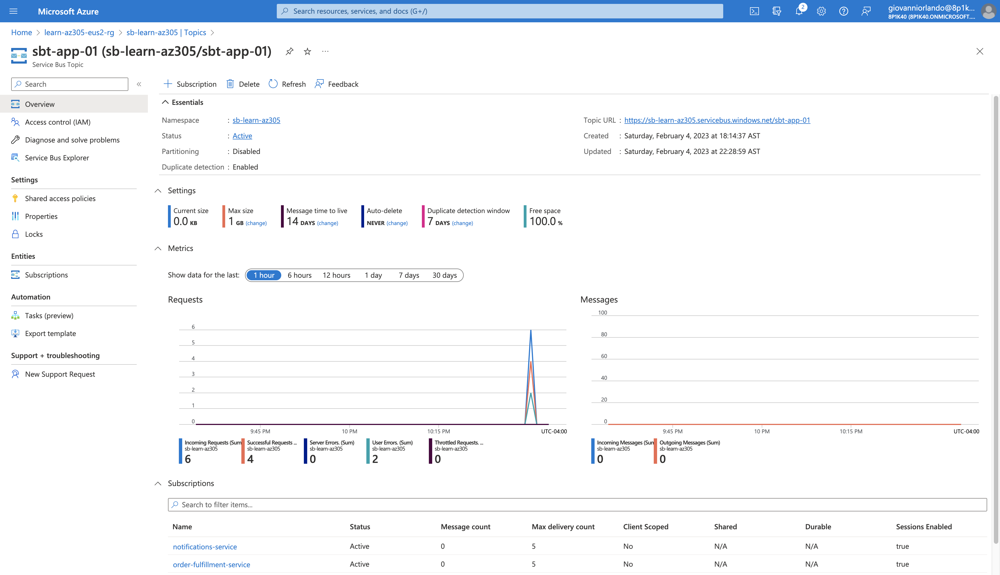
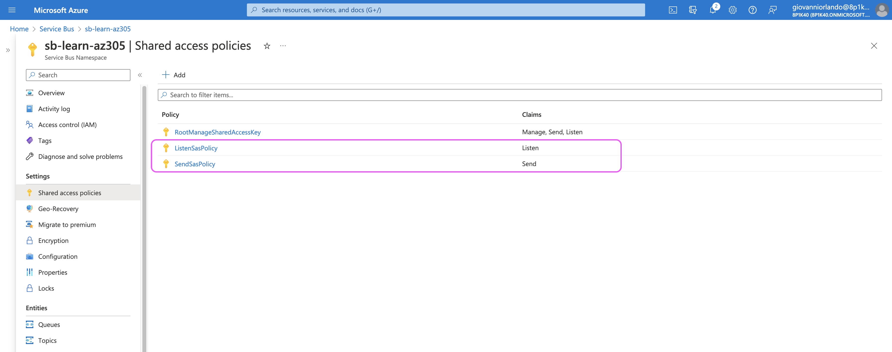
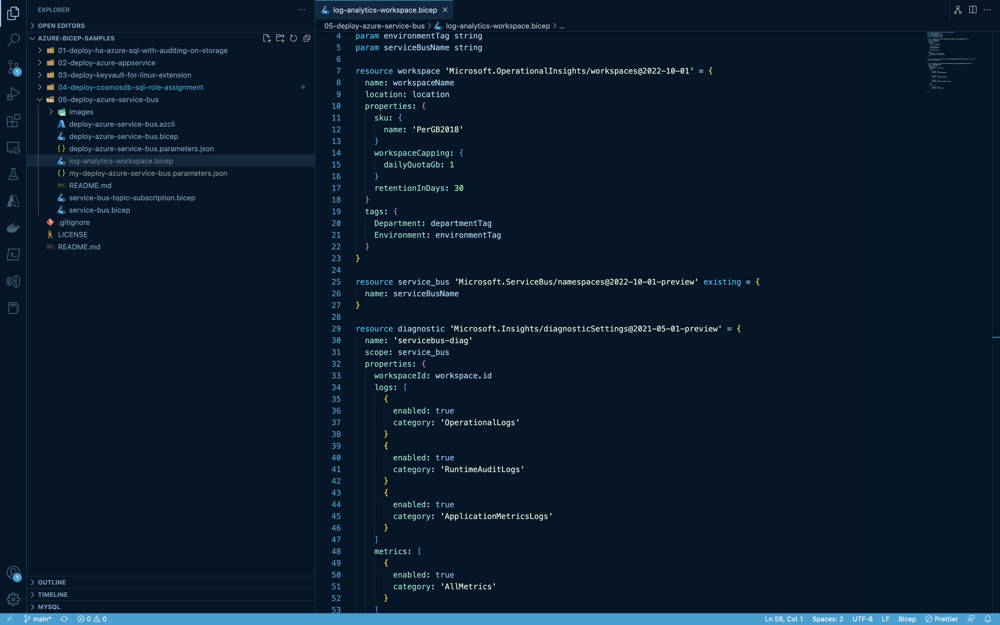
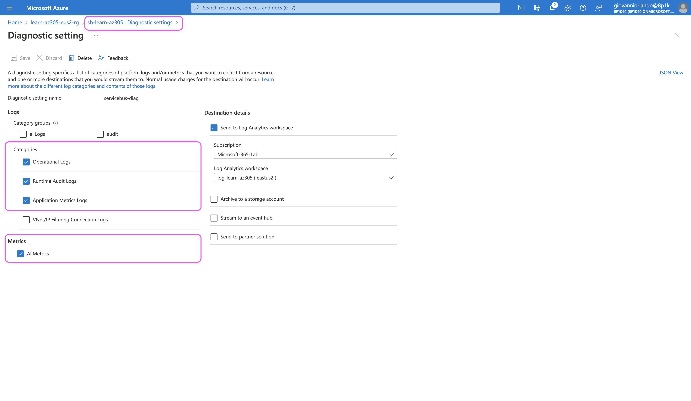

# 05 - Deploy Azure Service Bus

## Intro

This Bicep template deploys an Azure Service Bus Namespace to your Resource Group with the option of adding one or more queues, a topic and one or more subscriptions. It also configures a log analytic workspace and diagnostic settings for said namespace.

### What is Service Bus?

[Azure Service Bus](https://learn.microsoft.com/en-us/azure/service-bus-messaging/service-bus-messaging-overview) is a fully managed enterprise message broker with message queues and publish-subscribe topics. It's used to integrate applications or components that may span multiple communication protocols, data contracts, trust domains, or network environments.

Service Bus leverages the [Advanced Messaging Queueing Protocol (AMQP)](https://learn.microsoft.com/en-us/azure/service-bus-messaging/service-bus-amqp-overview) 1.0 an open ISO/IEC standard.

When deploying Service Bus there are three SKUs available to chose from: 'Basic', 'Standard', 'Premium'. Our template focuses on the Standard SKU, which offers support for both Queues and Topics.

For more advanced features such as: Private Endpoint, Availability Zones, Geo-Disaster Recovery and Customer Managed Keys (CMK), check out the [Premium SKU]((https://learn.microsoft.com/en-us/azure/service-bus-messaging/service-bus-premium-messaging)).

## Queues

Allow for first-in, first-out (FIFO) producer and consumer scenarios and represent a simple way to decouple applications from each other

## Topic and Subscriptions

Allow for publish and subscribe scenarios. With Topics, all Subscriptions receive a copy of each message. Each subscriber can filter for the messages they care for by SQL Filter or [Correlation Filters](https://learn.microsoft.com/en-us/azure/service-bus-messaging/topic-filters) such as 'label/subject', 'sessionId', 'correlationId' and more.

## Shared Access Policies
Service Bus includes a Root SAS Policy which grants full access to the namespace. This namespace should not be used within your app. This template includes two new SAS Policies: a Listen SAS and a Send SAS, to be used accordingly.

Service Bus also supports Azure AD Authorization which offers a more secure alternative to SAS Policies.

## Diagnostic Settings

Send diagnostic logs and metrics from the Service Bus Namespace to Log Analytics Workspace.

Log Categories
* OperationalLogs
* RuntimeAuditLogs
* ApplicationMetricsLogs

Metric Categories
* AllMetrics

## GitHub Link
https://github.com/gorlandor/azure-bicep-samples/05-deploy-azure-service-bus

## Conclusion

Hope you learned something today, I sure did. If you found this helpful, please share with your friends and teams.

Follow me on GitHub: [@gorlandor](https://github.com/gorlandor)

Follow me on Twitter: [@gorlandor](https://twitter.com/gorlandor)
